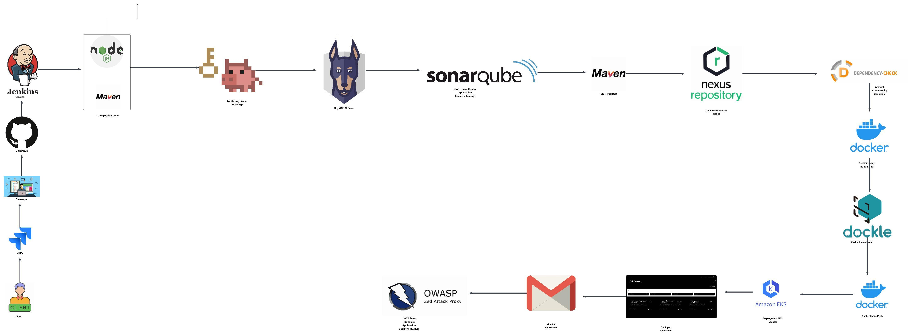
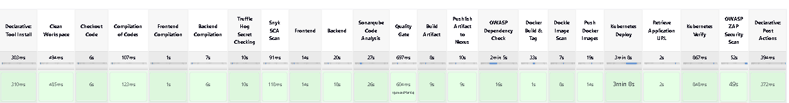
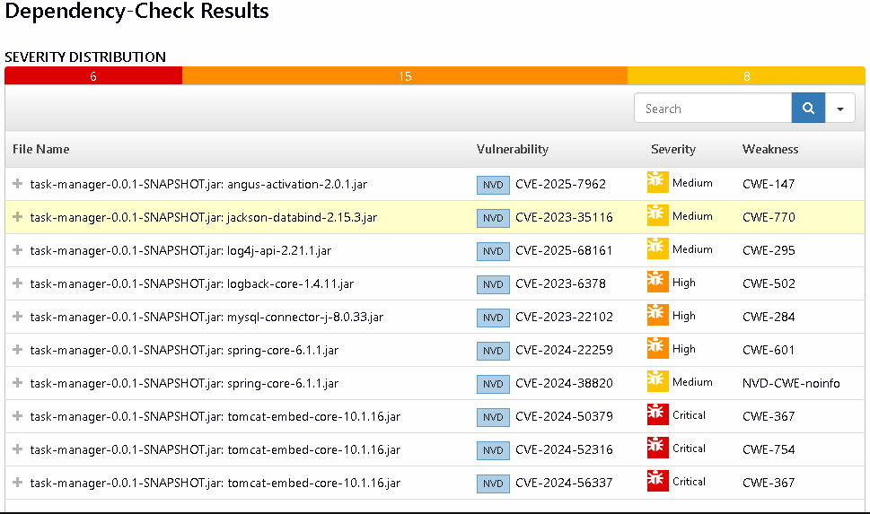
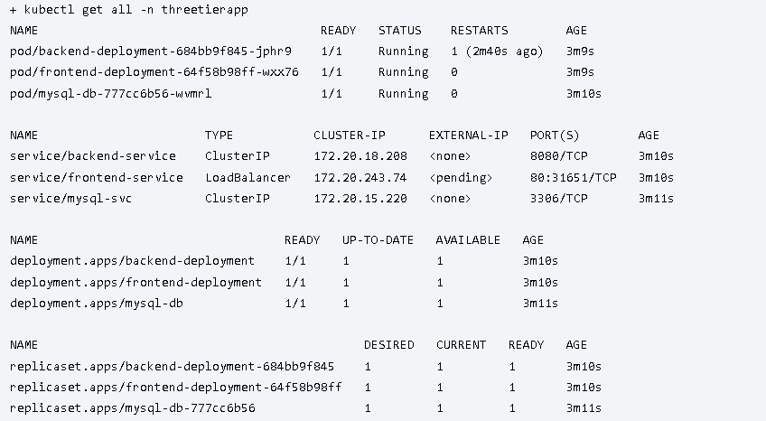
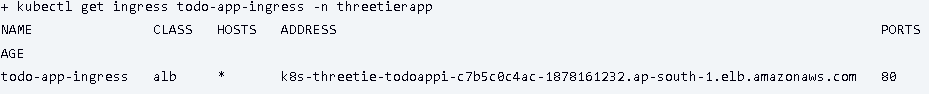
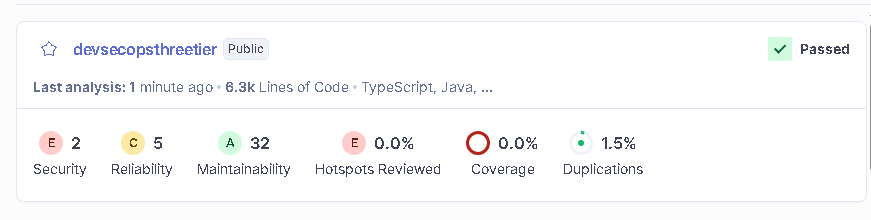
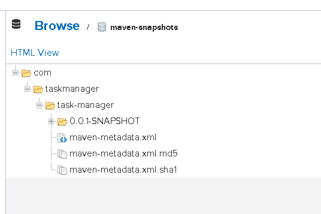

# 🛡️ DevSecOps Three-Tier Todo Application Pipeline

A **production-grade DevSecOps pipeline** for a Three-Tier Todo Application, demonstrating end-to-end security integration from code to deployment on AWS EKS with ALB Ingress.

[]()
[]()
[]()
[]()

---

## 📋 Overview

This project showcases a **complete DevSecOps Three-Tier pipeline** with multiple security scanning tools integrated at every stage—from secret detection to container vulnerability scanning—before deploying to AWS EKS with Application Load Balancer (ALB) Ingress Controller.

---

## 🏗️ Architecture Overview

### Three-Tier Architecture

```
┌─────────────────────────────────────────────────────┐
│                  ALB Ingress Controller             │
│           (Internet-facing Load Balancer)           │
└──────────────────┬──────────────────────────────────┘
                   │
         ┌─────────┴─────────┐
         │                   │
    ┌────▼────┐        ┌────▼────┐
    │Frontend │        │Backend  │
    │(React)  │───────▶│(Java)   │
    │Service  │        │Service  │
    └─────────┘        └────┬────┘
                            │
                       ┌────▼────┐
                       │Database │
                       │(MySQL)  │
                       └─────────┘
```

### Pipeline Flow

<p align="center">
    
</p>

---

## 🔧 Tech Stack

### **Application Layer**

```
Frontend (Tier 1):
├── React.js          # UI Framework
├── Node.js     # JavaScript Runtime
└── npm               # Package Manager

Backend (Tier 2):
├── JDK 17          # Java Development Kit
├── Maven           # Build Tool
└── Spring Boot       # Backend Framework

Database (Tier 3):
└── MySQL             # Relational Database
```

### **DevOps & Infrastructure**

```
CI/CD:
├── Jenkins           # Pipeline Orchestration
├── Git/GitHub        # Version Control
└── kubectl           # Kubernetes CLI

Containerization:
├── Docker            # Container Platform
└── Docker Hub        # Container Registry (17rj)

Orchestration:
├── AWS EKS           # Managed Kubernetes (ap-south-1)
├── ALB Ingress       # Application Load Balancer Controller
└── RBAC              # Role-Based Access Control

Artifact Repository:
└── Nexus             # Artifact Management
```

### **Security Tools (DevSecOps)**

```
Secret Scanning:
└── TruffleHog        # Detect hardcoded secrets in Git

Dependency Scanning (SCA):
├── Snyk              # Software Composition Analysis
└── OWASP Dependency  # Check known vulnerabilities

Code Quality (SAST):
└── SonarQube         # Static Application Security Testing

Container Security:
└── Dockle            # Docker Image Best Practices Linter

Dynamic Testing (DAST):
└── OWASP ZAP         # Web Application Security Scanner
```

---

## 🚀 Complete Pipeline Stages (23 Stages)

| Stage # | Stage Name              | Tool/Action | Purpose                              | Status |
| ------- | ----------------------- | ----------- | ------------------------------------ | ------ |
| 1       | Clean Workspace         | Jenkins     | Clean previous build artifacts       | ✅     |
| 2       | Checkout Code           | Git         | Clone repository from GitHub         | ✅     |
| 3       | Frontend Compilation    | Node.js     | Validate JavaScript syntax           | ✅     |
| 4       | Backend Compilation     | Maven       | Compile Java source code             | ✅     |
| 5       | TruffleHog Secret Scan  | TruffleHog  | Detect secrets in Git history        | ✅     |
| 6       | Snyk Frontend SCA       | Snyk        | Scan npm dependencies                | ✅     |
| 7       | Snyk Backend SCA        | Snyk        | Scan Maven dependencies              | ✅     |
| 8       | SonarQube Code Analysis | SonarQube   | SAST - Code quality & security       | ✅     |
| 9       | Quality Gate            | SonarQube   | Enforce quality standards            | ✅     |
| 10      | Build Artifact          | Maven       | Package backend JAR file             | ✅     |
| 11      | Publish to Nexus        | Nexus       | Upload artifacts to repository       | ✅     |
| 12      | OWASP Dependency Check  | OWASP DP    | Check for vulnerable dependencies    | ✅     |
| 13      | Docker Build Frontend   | Docker      | Build frontend container image       | ✅     |
| 14      | Docker Build Backend    | Docker      | Build backend container image        | ✅     |
| 15      | Docker Tag Images       | Docker      | Tag images for registry              | ✅     |
| 16      | Dockle Frontend Scan    | Dockle      | Scan frontend image security         | ✅     |
| 17      | Dockle Backend Scan     | Dockle      | Scan backend image security          | ✅     |
| 18      | Push Docker Images      | Docker Hub  | Push to container registry           | ✅     |
| 19      | Kubernetes Deploy       | kubectl     | Deploy to EKS cluster                | ✅     |
| 20      | Retrieve ALB URL        | kubectl     | Get Application Load Balancer URL    | ✅     |
| 21      | Kubernetes Verify       | kubectl     | Verify all resources running         | ✅     |
| 22      | OWASP ZAP Security Scan | ZAP         | Dynamic application security testing | ✅     |
| 23      | Cleanup                 | Docker      | Remove old images                    | ✅     |

---

## 🛠️ Prerequisites

### **1. Infrastructure Requirements**

#### **AWS EKS Cluster**

```bash
# Cluster Configuration
Name: expdevops-cluster
Region: ap-south-1 (Mumbai)
Kubernetes Version: 1.28+
Node Type: t3.medium (minimum)
Nodes: 2-3 worker nodes
```

#### **AWS Load Balancer Controller**

```bash
# ALB Ingress Controller must be installed
Version: v2.7.0+
IAM OIDC Provider: Enabled
Service Account: aws-load-balancer-controller
Namespace: kube-system

# Required IAM Permissions:
- ec2:DescribeRouteTables
- ec2:DescribeSubnets
- ec2:DescribeSecurityGroups
- elasticloadbalancing:*
```

**Setup Guide:** See [ALB Controller Installation](#alb-controller-setup)

### **2. Jenkins Configuration**

#### **Required Plugins**

```
✓ Pipeline Plugin
✓ Git Plugin
✓ Docker Pipeline Plugin
✓ Kubernetes CLI Plugin
✓ SonarQube Scanner Plugin
✓ OWASP Dependency-Check Plugin
✓ Config File Provider Plugin
✓ Snyk Security Plugin
✓ Credentials Plugin
```

#### **Tool Configuration**

```
Jenkins → Global Tool Configuration:

JDK:
  Name: jdk-17.0
  Install automatically: Yes
  Version: JDK 17.0.10

Maven:
  Name: maven-3.9
  Install automatically: Yes
  Version: 3.9.6

NodeJS:
  Name: nodejs-23.9
  Install automatically: Yes
  Version: 23.9.0

SonarQube Scanner:
  Name: sonar-scanner
  Install automatically: Yes
  Version: Latest
```

### **3. Required Credentials in Jenkins**

```
Credential ID          | Type              | Purpose
----------------------|-------------------|---------------------------
docker-cred           | Username/Password | Docker Hub login
kube-cred             | Secret file       | Kubernetes config
sonar-cred            | Secret text       | SonarQube token
snyk-cred             | Secret text       | Snyk API token
nvd-api-key           | Secret text       | NVD API key
nexus-settings        | Config file       | Maven settings.xml
```

### **4. External Services**

#### **SonarQube Server**

```
URL: http://your-sonarqube-server:9000
Project Key: devsecopsthreetier
Quality Gate: Configured
```

#### **Nexus Repository**

```
URL: http://your-nexus-server:8081
Repository: maven-releases
Authentication: Configured in settings.xml
```

#### **Docker Registry**

```
Registry: Docker Hub
Username: 17rj
Repositories:
  - three-tier-todo-frontend
  - three-tier-todo-backend
```

### **5. Security Tools Installation**

#### **On Jenkins Server**

```bash
# TruffleHog
pip3 install trufflehog

# Snyk
npm install -g snyk

# Dockle
wget https://github.com/goodwithtech/dockle/releases/download/v0.4.14/dockle_0.4.14_Linux-64bit.tar.gz
tar zxvf dockle_0.4.14_Linux-64bit.tar.gz
sudo mv dockle /usr/local/bin/

# Docker
sudo apt install docker.io -y
sudo usermod -aG docker $USER && newgrp docker


# HELM
sudo snap install helm --classic
```

### **6. Kubernetes RBAC Setup**

```bash
# Create namespace
kubectl create namespace threetierapp

# Apply RBAC for Jenkins
kubectl apply -f jenkins-rbac.yaml
```

---

## 📁 Project Structure

```
Three-Tier-Todo-Application/
├── frontend/                    # React.js application
│   ├── src/
│   │   ├── components/
│   │   ├── pages/
│   │   └── App.jsx
│   ├── Dockerfile
│   ├── package.json
│   └── nginx.conf
│
├── backend/                     # Spring Boot application
│   ├── src/
│   │   ├── main/
│   │   │   ├── java/
│   │   │   └── resources/
│   │   └── test/
│   ├── pom.xml
│   └── Dockerfile
│
├── K8s/                         # Kubernetes manifests
│   ├── secrets-configmap.yml
│   ├── db-ds-service.yml
│   ├── backend-ds-service.yml
│   ├── frontend-ds-service.yml
│   ├── ingress.yml
│   └── jenkins-rbac.yaml
│
├── Jenkinsfile      # Pipeline Defination
├── istio/
├── docker-compose.yaml          # Local development
├── snapshot/                    # Screenshots
└── README.md
```

---

## 🚦 Getting Started

### **1. Clone Repository**

```bash
git clone https://github.com/17J/Three-Tier-Todo-Application.git
cd Three-Tier-Todo-Application
```

### \*_2. Setup EKS Cluster_

# Clone Terraform repository

git clone https://github.com/17J/Terraform-AWS-EKS.git
cd Terraform-AWS-EKS/terraform/

# Initialize Terraform

terraform init

# Review the plan

terraform plan

# Apply configuration

terraform apply -auto-approve

# Verify cluster

kubectl get nodes

### **3. Install ALB Controller**

```bash
# Associate OIDC provider
eksctl utils associate-iam-oidc-provider \
  --region ap-south-1 \
  --cluster expdevops-cluster \
  --approve

# Create IAM policy
curl -o iam_policy.json https://raw.githubusercontent.com/kubernetes-sigs/aws-load-balancer-controller/v2.7.0/docs/install/iam_policy.json

aws iam create-policy \
  --policy-name AWSLoadBalancerControllerIAMPolicy \
  --policy-document file://iam_policy.json

# Create service account
eksctl create iamserviceaccount \
  --cluster=expdevops-cluster \
  --namespace=kube-system \
  --name=aws-load-balancer-controller \
  --attach-policy-arn=arn:aws:iam::YOUR_ACCOUNT_ID:policy/AWSLoadBalancerControllerIAMPolicy \
  --override-existing-serviceaccounts \
  --approve

# Install controller via Helm
helm repo add eks https://aws.github.io/eks-charts
helm install aws-load-balancer-controller eks/aws-load-balancer-controller \
  -n kube-system \
  --set clusterName=expdevops-cluster \
  --set serviceAccount.create=false \
  --set serviceAccount.name=aws-load-balancer-controller
```

### **4. Create Namespace & RBAC**

```bash
# Create namespace
kubectl create namespace threetierapp

# Apply Jenkins RBAC
kubectl apply -f K8s/jenkins-rbac.yaml
```

### **5. Configure Jenkins Pipeline**

```bash
1. Create new Pipeline job
2. Configure Git repository
3. Point to Jenkinsfile
4. Add all required credentials
5. Run pipeline
```

---

## 📊 Pipeline Results

### **Jenkins Pipeline Stages View**

<p align="center">
    
</p>

### **OWASP Dependency Check Results**

<p align="center">
    
</p>

### **Kubernetes Deployment Status**

<p align="center">
    
</p>

### **ALB Ingress Controller**

<p align="center">
    
</p>

### **SonarQube SAST Analysis**

<p align="center">
    
</p>

### **Nexus Artifact Repository**

<p align="center">
    
</p>

---

## 🖼️ Application Screenshots

<table>
  <tr>
    <td align="center">
      
      <br><b>Todo List Dashboard</b>
    </td>
    <td align="center">
      
      <br><b>Add New Task</b>
    </td>
    <td align="center">
      
      <br><b>Task Management</b>
    </td>
  </tr>
</table>

---

## 🔐 Security Features Implemented

### **Shift-Left Security**

- ✅ **Secret Detection (TruffleHog)** - Scans Git history for leaked credentials
- ✅ **Dependency Scanning (Snyk + OWASP)** - Identifies vulnerable packages
- ✅ **SAST (SonarQube)** - Static code analysis for bugs & vulnerabilities
- ✅ **Container Scanning (Dockle)** - Docker image best practices validation

### **Runtime Security**

- ✅ **DAST (OWASP ZAP)** - Dynamic application security testing
- ✅ **Quality Gates** - Automated quality enforcement
- ✅ **RBAC in Kubernetes** - Least privilege access control
- ✅ **Network Policies** - Ingress controller security

### **Compliance & Governance**

- ✅ **Artifact Traceability** - Nexus repository integration
- ✅ **Build Reproducibility** - Tagged Docker images
- ✅ **Audit Trails** - Jenkins build logs

---

## 🎯 Key Features

### **DevOps Best Practices**

- 🔄 **CI/CD Automation** - Fully automated pipeline from code to production
- 🐳 **Containerization** - Docker multi-stage builds
- ☸️ **Orchestration** - Kubernetes with auto-scaling
- 🔀 **GitOps** - Version-controlled infrastructure

### **Security Best Practices**

- 🔒 **Zero Trust** - RBAC and network policies
- 🛡️ **Defense in Depth** - Multiple security layers
- 📊 **Continuous Monitoring** - Security scans at every stage
- 🚨 **Fail Fast** - Early detection of vulnerabilities

### **Production Ready**

- ⚡ **High Availability** - Multi-replica deployments
- 📈 **Scalability** - Kubernetes HPA support
- 🔍 **Observability** - Logging and monitoring ready
- 🌐 **Load Balancing** - AWS ALB with health checks

---

## 📝 Environment Variables

### **Required in Jenkinsfile**

```groovy
SCANNER_HOME         # SonarQube scanner path
FRONTEND_IMAGE_NAME  # Frontend Docker image name
BACKEND_IMAGE_NAME   # Backend Docker image name
IMAGE_TAG            # Build number
DOCKER_REGISTRY      # Docker Hub username
K8S_NAMESPACE        # Kubernetes namespace
```

### **Application Environment**

```bash
# Backend
SPRING_DATASOURCE_URL=jdbc:mysql://mysql-service:3306/tododb
SPRING_DATASOURCE_USERNAME=root
SPRING_DATASOURCE_PASSWORD=***

# Frontend
REACT_APP_API_URL=/api
```

---

## 🐛 Troubleshooting

### **ALB Controller Issues**

```bash
# Check controller logs
kubectl logs -n kube-system deployment/aws-load-balancer-controller

# Verify IAM permissions
kubectl describe sa aws-load-balancer-controller -n kube-system

# Check ingress status
kubectl describe ingress todo-app-ingress -n threetierapp
```

### **Jenkins RBAC Issues**

```bash
# Test permissions
kubectl auth can-i create deployments \
  --as=system:serviceaccount:threetierapp:jenkins \
  -n threetierapp

# Recreate service account token
kubectl delete secret jenkins-token -n threetierapp
kubectl create secret generic jenkins-token \
  --from-literal=token=$(kubectl create token jenkins -n threetierapp)
```

### **Pipeline Failures**

```bash
# Check pod logs
kubectl logs -n threetierapp <pod-name>

# Verify secrets
kubectl get secrets -n threetierapp

# Check service endpoints
kubectl get endpoints -n threetierapp
```

---

## 🚀 Deployment

### **Manual Deployment**

```bash
# Deploy to Kubernetes
kubectl apply -f K8s/secrets-configmap.yml -n threetierapp
kubectl apply -f K8s/db-ds-service.yml -n threetierapp
kubectl apply -f K8s/backend-ds-service.yml -n threetierapp
kubectl apply -f K8s/frontend-ds-service.yml -n threetierapp
kubectl apply -f K8s/ingress.yml -n threetierapp

# Get ALB URL
kubectl get ingress todo-app-ingress -n threetierapp
```

### **Via Jenkins Pipeline**

```bash
# Trigger pipeline
# Pipeline will automatically:
# 1. Run all security scans
# 2. Build and push Docker images
# 3. Deploy to Kubernetes
# 4. Configure ALB ingress
# 5. Run DAST scan
```

---

## 📈 Monitoring & Logging

### **View Logs**

```bash
# Frontend logs
kubectl logs -f deployment/frontend -n threetierapp

# Backend logs
kubectl logs -f deployment/backend -n threetierapp

# Database logs
kubectl logs -f statefulset/mysql -n threetierapp
```

### **Check Resources**

```bash
# All resources
kubectl get all -n threetierapp

# Ingress status
kubectl get ingress -n threetierapp

# Pod status
kubectl get pods -n threetierapp -o wide
```

---

## 🤝 Contributing

Contributions are welcome! Please follow these steps:

1. Fork the repository
2. Create feature branch (`git checkout -b feature/AmazingFeature`)
3. Commit changes (`git commit -m 'Add AmazingFeature'`)
4. Push to branch (`git push origin feature/AmazingFeature`)
5. Open Pull Request

---

## 📄 License

This project is licensed under the MIT License - see the [LICENSE](LICENSE) file for details.

---

## 👨‍💻 Author

**Rahul Joshi**  
📧 Email: [17rahuljoshi@gmail.com](mailto:17rahuljoshi@gmail.com)  
🔗 GitHub: [@17J](https://github.com/17J)

---

## ⭐ Show Your Support

Give a ⭐ if this project helped you learn DevSecOps practices!

---

## 📚 Additional Resources

- [AWS EKS Documentation](https://docs.aws.amazon.com/eks/)
- [ALB Ingress Controller Guide](https://kubernetes-sigs.github.io/aws-load-balancer-controller/)
- [Jenkins Pipeline Syntax](https://www.jenkins.io/doc/book/pipeline/syntax/)
- [SonarQube Documentation](https://docs.sonarqube.org/)
- [OWASP Top 10](https://owasp.org/www-project-top-ten/)

---

**Built with ❤️ for the DevSecOps Community**
